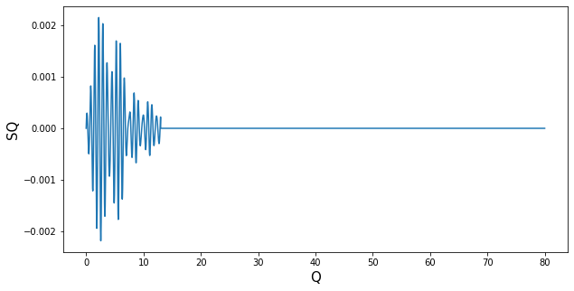
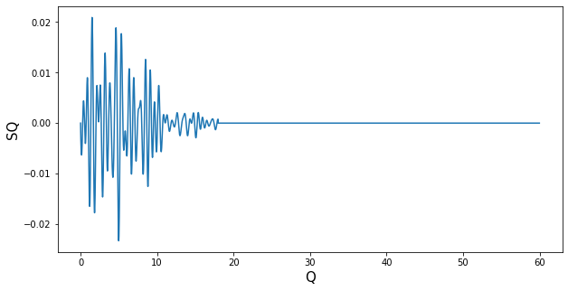

# SMC22-AutoSignalExtraction
Extra charts related to the SMC2022 paper on automatic signal extraction

# Components automatically extracted for Amorphous dataset

## Component 1

## Component 2

## Component 3

## Component 4

# Components automatically extracted for Crystalline dataset

## Component 1

## Component 2

## Component 3

## Component 4

## Component 5

## Component 6

## Component 7

